  # Azure Active Directory Lab on Windows Server 2022

This project documents the setup of a Windows Server 2022 virtual machine on Microsoft Azure for practicing Active Directory (AD) configuration. It is intended as a portfolio project to demonstrate cloud infrastructure and identity management skills.

----

## 📁 GitHub Documentation

This repository includes:
- Step-by-step setup instructions
- Screenshots of the Azure portal and AD configuration
- Notes on security, troubleshooting, and lessons learned

---
## 🚀 Project Purpose

- Learn how to deploy and configure a Windows Server VM on Azure
- Practice installing and managing Active Directory Domain Services (AD DS)
- Showcase cloud and identity skills on a GitHub portfolio

---

## 🛠️ Azure VM Configuration

| Setting                     | Value                                      |
|----------------------------|--------------------------------------------|
| **VM Name**                | AD-DC-VM                                   |
| **Region**                 | West US 2                                  |
| **Availability Zone**      | Zone 2                                     |
| **Image**                  | Windows Server 2022 Datacenter - Gen2      |
| **VM Size**                | Standard D2s v3 (2 vCPUs, 8 GiB RAM)       |
| **OS Disk Type**           | Premium SSD LRS                            |
| **Security Type**          | Trusted Launch (Secure Boot + vTPM)        |
| **Public Inbound Ports**   | RDP (3389)                                 |
| **Accelerated Networking** | Enabled                                    |
| **Resource Group**         | AD-Lab-RG                                  |
| **Virtual Network**        | AD-DC-VM-vnet                              |
| **Subnet**                 | default (10.0.0.0/24)                       |
| **Public IP**              | AD-DC-VM-ip                                |
| **NSG**                    | Basic (RDP open to internet for testing)   |

---

## 🔐 Security Notes

- RDP (port 3389) is open to the internet **only for testing**.
- After deployment, restrict RDP access to your IP:
  1. Go to **Network Security Groups** in Azure.
  2. Add an inbound rule:
     - Source: IP Addresses
     - Source IP: `your-public-ip`
     - Destination Port: 3389
     - Action: Allow
  3. Remove the default "Allow RDP from Any" rule.

---

## 🧩 Active Directory Setup (Post-Deployment)

### 📸 Screenshots
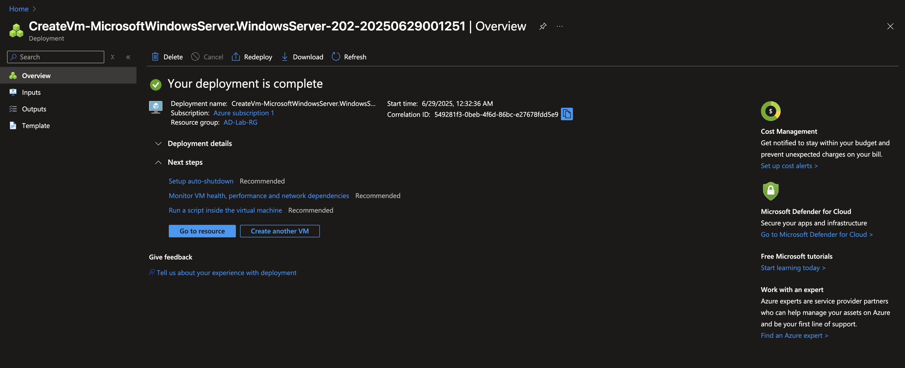
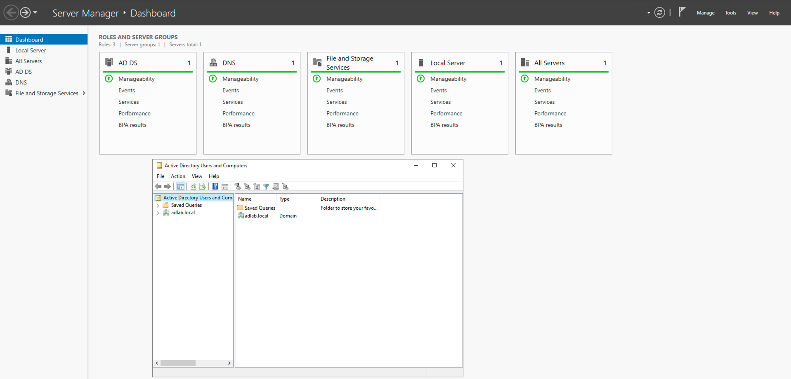

1. **Connect via RDP** to the VM.
2. Open **Server Manager** > Add Roles and Features.
3. Install **Active Directory Domain Services (AD DS)**.
4. Promote the server to a **Domain Controller**:
   - Add a new forest: `adlab.local`
   - Set DSRM password
5. Reboot and log in with domain credentials.
6. Open **Active Directory Users and Computers** to verify.

---

### 🧪 Sample Organizational Units and Users
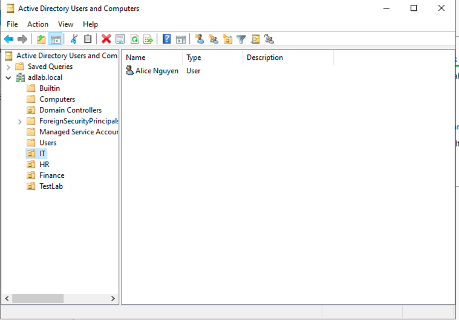
After verifying the domain setup, the following Organizational Units (OUs) and sample users were created for demonstration purposes:

**Organizational Units (OUs):**
- IT
- HR
- Finance
- TestLab

**Sample Users:**
- `Alice Nguyen` in OU: IT
- `Bob Tran` in OU: HR
- `Charlie Le` in OU: Finance
- `Test User` in OU: TestLab

These users were created using the 'Active Directory Users and Computers' tool by right-clicking the respective OU and selecting **New > User**.

---

## 👥 Managing Users and Organizational Units

After creating a new user in Active Directory:

1. **Move User to an Organizational Unit (OU)**
   - If the user is in the default "Users" container:
     - Right-click the user > **Move**
     - Select the appropriate OU (e.g., `IT`, `HR`, `Finance`, `TestLab`)

2. **Assign Group Memberships**
   - Right-click the user > **Properties**
   - Go to the **Member Of** tab
   - Click **Add** to assign the user to groups like:
     - `Domain Users` (default)
     - Custom groups (e.g., `IT Admins`, `HR Staff`)

3. **Test Login (Optional)**
   - Join another VM to the domain
   - Log in using the new user's credentials to verify access

---

## 🖥️ Adding a Windows 11 Client VM for Domain Login Testing

To simulate a domain-joined client environment, a second virtual machine was created using **Windows 11 Pro**.

### ✅ VM Configuration

| Setting | Value |
|--------|-------|
| **VM Name** | AD-Client-VM |
| **Region** | West US 2 |
| **Availability Zone** | Zone 2 |
| **Image** | Windows 11 Pro, version 23H2 - x64 Gen2 |
| **VM Size** | Standard D2s v3 |
| **Resource Group** | AD-Lab-RG |
| **Virtual Network** | AD-DC-VM-vnet |
| **Subnet** | default (10.0.0.0/24) |
| **Public IP** | Enabled (for RDP access) |
| **NSG** | RDP (3389) open for testing |
| **Security Type** | Trusted Launch |

### 🪟 Initial Setup Screenshot

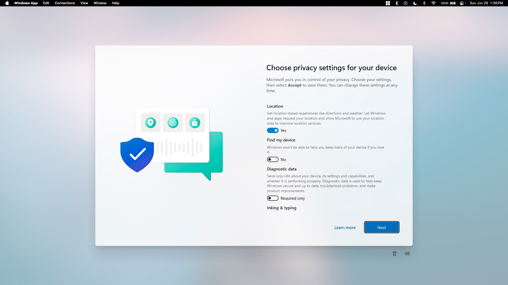

> *Screenshot: Windows 11 privacy settings screen during initial setup.*

### 🔐 RDP Access from macOS

- **Tool Used**: Microsoft Remote Desktop (from Mac App Store)
- **Connection**: Public IP of the VM with local admin credentials
- **Status**: Successfully connected and ready for domain join

### 🔗 How to know the Domain name
1. Open **Server Manager** → **Local Server**
2. View the Domain name
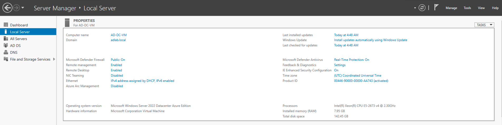

## 🌐 Configure DNS and Join Domain

To enable domain discovery and authentication, the Windows 11 client must use the domain controller as its DNS server.

### 🛠️ Change DNS Settings

1. Open **Settings** → **Network & Internet** → **Ethernet**.
2. Click **Edit** next to **DNS server assignment**.
3. Set the following:
   - **Preferred DNS**: `10.0.0.4` (private IP of AD-DC-VM)
   - **Alternate DNS**: *(optional)*

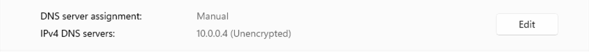  
> *Screenshot: Configuring DNS to point to the domain controller.*

### 🔗 Join the Domain

1. Press `Windows + R`, type `sysdm.cpl`, and press Enter.
2. In the **Computer Name** tab, click **Change…**
3. Select **Domain**, and enter: `adlab.local`
4. When prompted, enter domain credentials:
   - **Username**: `adlab\Administrator`
   - **Password**: *your domain admin password*

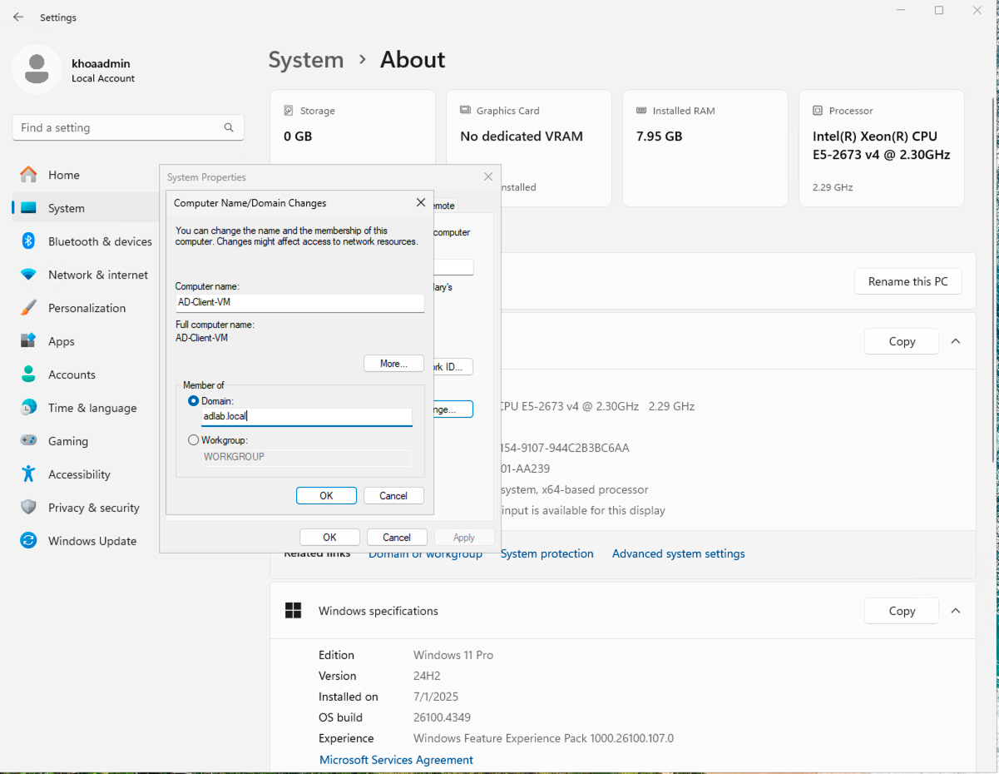  
> *Screenshot: Entering domain name to join.*

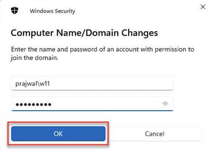  
> *Screenshot: Providing domain admin credentials.*

5. You should see a welcome message confirming domain join.

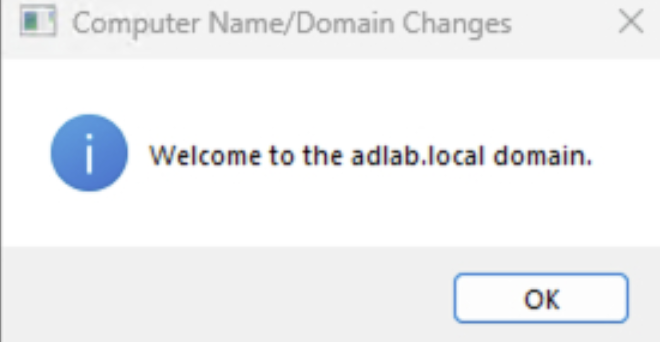  
> *Screenshot: Successfully joined the domain.*

6. Restart the VM when prompted.

### 🔐 Log in with Domain Account

At the login screen:
- Click **Other user**
- Enter:
  - **Username**: `adlab\Administrator`
  - **Password**: *your domain password*

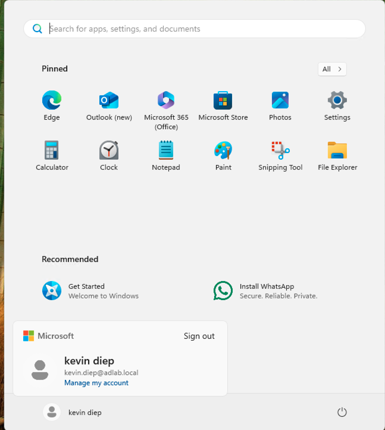  
> *Screenshot: Logging in with domain credentials.*
- **Tool Used**: Microsoft Remote Desktop (from Mac App Store)
- **Connection**: Public IP of the VM with local admin credentials
- **Status**: Successfully connected and ready for domain join

---
## If You Get This Error
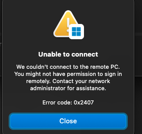

### ✅ Before Trying Again

Use these credentials:
- **Username**: `adlab\kevin.diep`
- **Password**: *(new password you just set)*

If you're using **Microsoft Remote Desktop on macOS**:
1. Edit the saved connection.
2. Add a new user account with the domain credentials.

---
## 🛠️ Troubleshooting RDP Login with Domain Accounts

If you're having trouble logging into a domain account via RDP, follow these steps:

###  Step1: 🔐 Grant RDP Access to the Domain User

1. **Log into the AD-DC-VM** (or use the Windows 11 client as `khoaadmin`).
2. Open **System Properties**:
   - Press `Windows + R`, type `sysdm.cpl`, and press Enter.
3. Go to the **Remote** tab.
4. Under **Remote Desktop**, click **Select Users…**
5. Click **Add**, then:
   - Type: `adlab\kevin.diep`
   - Click **Check Names**, then **OK**

This adds `kevin.diep` to the **Remote Desktop Users** group.
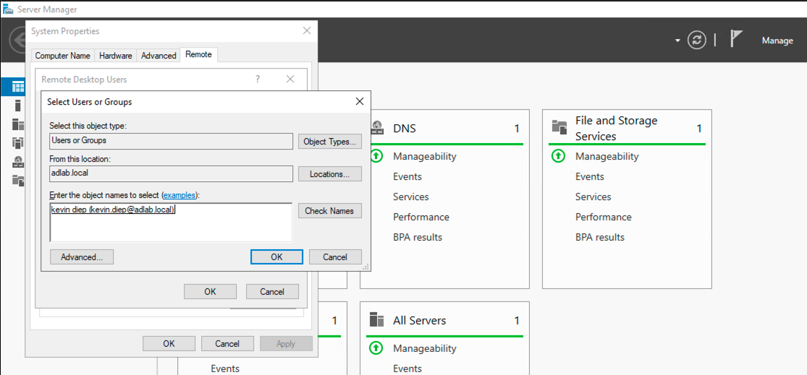
---

###  Step 2🧰 Add Domain User to Remote Desktop Users Group

1. On the **Windows 11 client VM**, login as **khoaadmin** account, open **Computer Management**:
   - Press `Windows + R`, type `compmgmt.msc`, and press Enter.
2. Navigate to:
   - `System Tools > Local Users and Groups > Groups`
3. Double-click **Remote Desktop Users**
4. Click **Add…**
5. In the object name field, type:
   - `adlab\kevin.diep`
6. Click **Check Names**, then **OK**
7. Click **Apply** and **OK** to save.
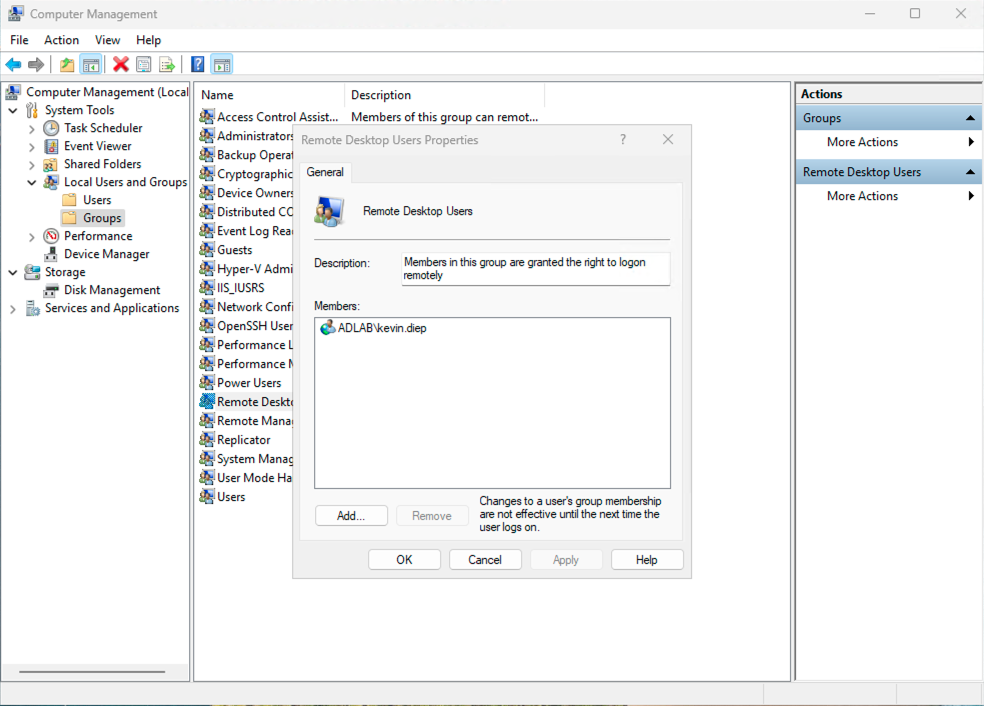
---

### 🔁 Try Logging In Again

Use:
- **Username**: `adlab\kevin.diep`
- **Password**: *(your set password)*
## 📚 What to Explore Next in Active Directory

Here are some basic tasks to continue learning:

- ✅ Create and manage **Security Groups** and **Distribution Groups**
- ✅ Apply **Group Policy Objects (GPOs)** to OUs
- ✅ Join a **client machine** to the domain
- ✅ Set up **Group Policy for password policies or desktop settings**
- ✅ Enable **auditing** for user logins and changes
- ✅ Delegate administrative control over specific OUs
- ✅ Explore **Active Directory Sites and Services** for replication

---

## ✅ Status:
- ✅ VM successfully deployed and validated
- ✅ Active Directory installed and domain controller promotion complete
- ✅ Logged into the domain and verified AD DS and DNS roles
- ✅ RDP access secured post-deployment
- ✅ Project documented on GitHub
---

## 👤 Author

**Khoa Diep**  
Azure Enthusiast | Windows Server | Active Directory | Cloud Projects

